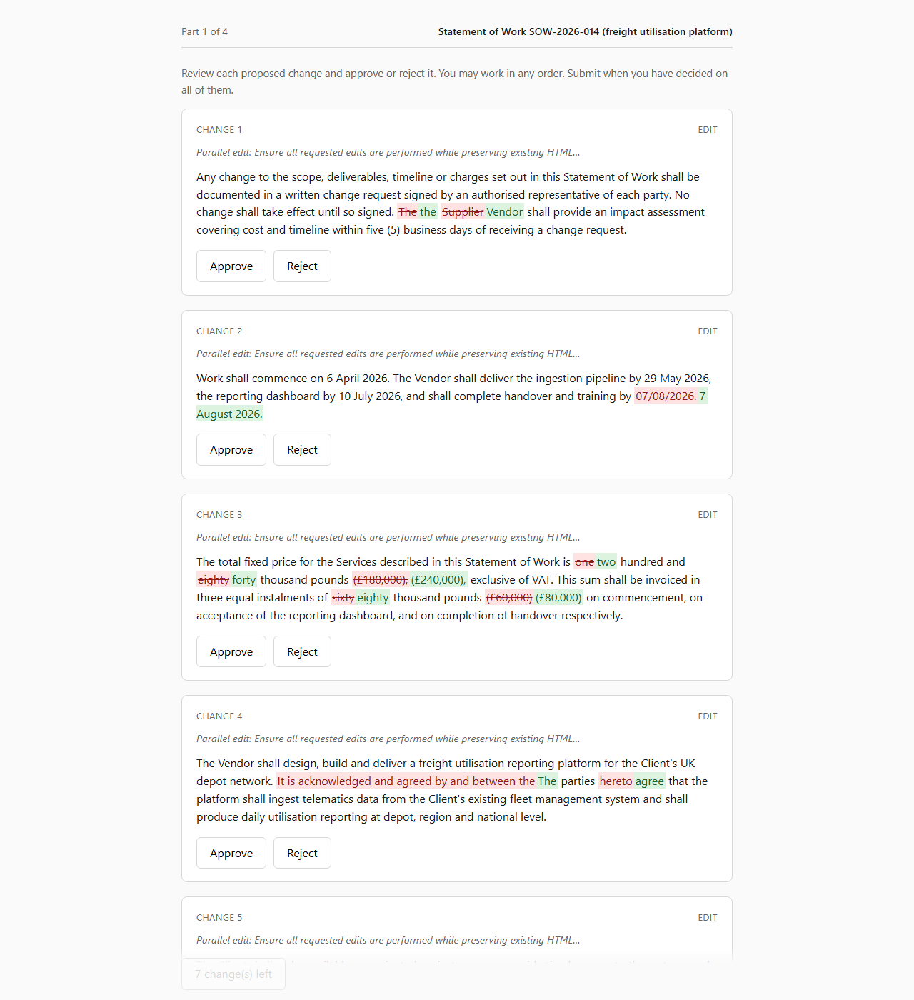

# Human review-cost evaluation for AI-proposed document changes

> Built by **Ranjan Jamnis** for the SuperDocs take-home task (Task 2: Human
> Review-Cost Evaluation), August 2026. Uses the SuperDocs API for corpus
> generation only — 9 operations, free tier, $0.

A measurement harness that asks, empirically: **how does the way you present an
AI's proposed edits change the cost and reliability of human review?**



*The `batch_section` condition. Deletions struck through in red, insertions in
green. Nothing on this page reveals which changes are seeded-bad — the API never
sends labels to the client. More views in [`docs/`](docs/).*

Reviewers judge real SuperDocs-generated changes to synthetic contracts under
four presentation conditions. It records decision time, inter-reviewer
agreement, and error rate against a pre-registered answer key.

**Status:** harness complete and tested end-to-end, corpus built against the
live SuperDocs API, and one reviewer run completed (N = 1). Results are in
[`REPORT.md`](REPORT.md) — with accuracy and Fleiss' κ deliberately suppressed
rather than printed, because at N = 1 with a single verdict used throughout,
neither is a measurement. See the recommendation for what a defensible answer
would require.

## SuperDocs features used

| Feature | How it is used |
| --- | --- |
| **Async chat editing** — `POST /v1/chat/async` | The whole corpus. Each synthetic contract is sent with a batch of requested edits and `approval_mode: "ask_every_time"`, so the model proposes changes without applying them. |
| **Job polling** — `GET /v1/jobs/{job_id}` | Every call is asynchronous. The client polls until the job reaches `awaiting_approval`, tolerating a cold-start first request and distinguishing a genuine approval pause from a `continue_prompt`. |
| **HITL `pending_changes` capture** | The proposed changes are read from `metadata.pending_changes` (`change_id`, `operation`, `chunk_id`, `old_html`, `new_html`, `ai_explanation`) and frozen into `study_data/batches.json`. This *is* the study stimulus. |
| **Usage / operations accounting** | Spend is read from each response's usage block rather than counted locally, and enforced against a hard cap before dispatch. |

**Not used, deliberately:**

- **`/approve`** — the study serves a frozen corpus so every reviewer sees
  byte-identical content, and replaying decisions to the real endpoint would
  mutate the documents mid-study. Listed as optional depth in the plan, cut for
  time.
- **MCP** — the deliverable is a standalone reproducible script, so the REST
  API is used directly rather than through an MCP client.
- **Export** — the study measures the *review decision*, not the resulting
  document, so no `.docx`/PDF is ever produced.

## This round is a single-rater pilot

**Single-rater pilot due to the 2-day build window; no panel was recruited.**
N = 1, the study designer as sole reviewer.

| Measure | Status |
| --- | --- |
| Decision time, per condition | **Reported** — median and IQR |
| Accuracy vs ground truth, per condition | **Reported** — with 95% Wilson intervals |
| Inter-reviewer agreement (Fleiss' κ) | **Undefined, reported as `—` with the reason stated** |

κ measures agreement *between* raters; with one rater there is nothing to
compare. It is displayed as undefined rather than omitted, and no substitute
statistic is put in its place — a results table that quietly drops its agreement
column invites the reader to assume agreement was fine.

**A production version would need a real panel. That is the clear next step.**
Until it exists, no claim here about which presentation is better should be
treated as established: with one reviewer, a difference between conditions is
indistinguishable from that reviewer being more alert during one of them.

### Blinding, and what it cost

The designer and the reviewer being the same person is a conflict, since
someone who has seen the answer key cannot then review against it.

- **doc01 is excluded from the study.** Its labels were shown to the designer
  during confirmation. It is kept as the pipeline's worked example and the GT-7
  case study, flagged `exclude_from_study`, and the backend refuses to serve it.
- **doc02–doc05 labels were confirmed by the assistant** and never displayed to
  the human reviewer.
- **This weakens ground truth and the weakening is real:** the answer key for
  the four reviewed documents rests on an AI's reading of each diff, not the
  designer's. The alternative — the reviewer approving labels for documents they
  are about to judge — would not weaken the measurement but destroy it.

---

## Budget: stated cap vs actual spend

| | Operations |
| --- | --- |
| Cap stated before running (pilot) | **5** |
| Cap stated before running (full corpus) | **15** |
| **Server-confirmed spend** (`monthly_used`) | **2** |
| **Conservative ledger total** | **9** |
| Cost | $0 (free tier, 500 ops/month) |

Ledger breakdown: 9 operations across 3 warm-ups (2 free, 1 billed) and 8
corpus calls — doc01 ×2, doc02, doc03, doc04 ×3, doc05. doc04 took three
attempts; see the SuperDocs findings below.

Two numbers because they measure different things, and reporting only the
flattering one would be dishonest.

A HITL job parked at `awaiting_approval` returns an **empty `result`** with no
usage block, so the API reports nothing about what it cost. The client records a
conservative **estimated** 1 operation in that case, flagged `ESTIMATED` in
`study_data/ops_ledger.jsonl`, rather than recording 0 — a budget guard that
under-counts would authorise the next call on the strength of a field the server
never sent.

What actually happened: `monthly_used` reached 2, both from warm-up calls. Every
corpus job is still parked at `awaiting_approval` and therefore unbilled.
Confirmed spend is 2; it becomes 9 if those jobs are ever approved. **One
operation was wasted** — a rerun over existing checkpoints ran a warm-up it did
not need. Fixed, with a regression test.

Full reasoning: `PROGRESS.md` A7, A12.

## Results

One reviewer, 27 decisions, all four conditions. Full write-up in
[`REPORT.md`](REPORT.md).

| Condition | n | Median decision time | IQR | Accuracy | Fleiss' κ |
| --- | --- | --- | --- | --- | --- |
| `batch_section` | 7 | 63.4s | 48.8–97.7s | — | — |
| `batch_whole` | 7 | 45.9s | 34.9–56.6s | — | — |
| `sequential_section` | 6 | 13.8s | 5.1–15.5s | — | — |
| `sequential_whole` | 7 | 14.4s | 11.9–25.3s | — | — |

**Accuracy and κ are suppressed, not missing.** The reviewer used a single
verdict (`approve`) for all 27 changes, so nothing here measures
discrimination — the accuracy figure would be the corpus base rate wearing an
accuracy label. κ needs two raters. Both are printed as `—` with the reason
stated, and `analyze.py` emits data-quality warnings *above* the results table
rather than below it.

The batch medians also carry a caveat: 4 of 7 `batch_section` changes were
already on screen when the batch rendered, so their clocks started at render
rather than at engagement. The sequential figures are sound.

**This does not rank the presentation conditions**, and the recommendation says
so first rather than last.

## Quick start

```bash
pip install -r requirements.txt

# 1. Build the corpus (needs SUPERDOCS_API_KEY in .env; spends operations)
python corpus_builder.py --mode pilot --propose-labels   # 0 ops: writes diffs for review
python corpus_builder.py --mode pilot                    # builds batches.json

# 2. Backend
uvicorn backend.main:app --reload --port 8000

# 3. Reviewer UI
cd frontend && npm install && npm run dev                # http://localhost:5173

# 4. After reviewers have run
python analysis/analyze.py                               # writes REPORT.md + raw_timings.csv
```

## Tests — 176, none needing an API key

```bash
python -m pytest tests/ -q                               # 152 passed
cd frontend && node --test "tests/*.test.js"             #  24 passed
```

Nothing in the suite touches the network, and the SuperDocs client is exercised
through an injected transport. That covers the branches a live account would
otherwise be needed for: the endpoint 404-fallback, budget refusal, job failure,
cold-start timeout, and usage-reported-exactly-once.

`node --test` is used with no dev dependencies, so the frontend tests run before
`npm install`.

## Layout

```
corpus_builder.py        # calls SuperDocs, captures changes, builds the answer key
superdocs_client.py      # thin REST wrapper: ops ledger + hard budget ceiling
ground_truth.py          # labelling, reviewer-safe serialization, scoring
corpus/
  documents/             # synthetic source documents (fictional parties)
  edit_specs.py          # seeded edit intents + provisional labels
backend/
  main.py                # FastAPI: serve batches, record decision events
  assignment.py          # Latin-square counterbalancing
  store.py               # batches in, append-only events out
frontend/
  src/timing.js          # the decision clock (tested directly, no browser)
  src/useDecisionTimer.js# the one timer hook all four views share
  src/views/             # the four condition views
  src/diff.js            # dependency-free word-level diff
analysis/
  stats.py               # Fleiss' kappa, percentiles, Wilson intervals
  analyze.py             # writes REPORT.md + raw_timings.csv
GROUND_TRUTH_SAFETY.md   # the seven invariants, each with a named test
PROTOCOL.md              # written and committed BEFORE data collection
PROGRESS.md              # running assumptions log with reasoning
```

## Ground truth, and why it is fenced off

The error-rate measurement is worthless if a reviewer can tell which changes are
seeded-bad. A leak would not announce itself — it would show up as suspiciously
high accuracy that reads like a finding.

`GROUND_TRUTH_SAFETY.md` states seven invariants, written **before** the
labelling code, each with a test naming the invariant it defends. The two that
shaped the design most:

- **GT-1** — the reviewer view is a field **whitelist**, so a ground-truth field
  added later is invisible by default rather than leaking until someone
  remembers to censor it. Proven by injecting a novel field and asserting it
  never surfaces, including over live HTTP for every endpoint.
- **GT-3** — the strongest form of "ids don't encode the label": build a batch
  twice with **every label inverted** and assert the reviewer view is
  byte-identical.

**GT-7 was added after the pilot proved it was needed.** The corpus originally
labelled changes from the *intent* of the edit requested. On the live run,
SuperDocs was asked for a meaning-preserving rewrite and returned one that
deleted the obligation entirely — so the pre-registered label said *approve*
where the correct answer was *reject*. A wrong key does not fail loudly; it
produces a plausible accuracy number that is quietly inverted, scoring every
reviewer who judged correctly as having erred. Labels are now provisional until
confirmed against the change's actual before/after text, and `build_batch`
refuses to pre-register unconfirmed ones.

Notably the original six invariants would not have caught this: they all guard
the key's *secrecy* while assuming its *correctness*.

## Assumptions logged (full reasoning in `PROGRESS.md`)

1. **`TASK.md` was absent** from the repo; `PLAN.md.pdf` is used as the
   governing spec. The budget cap — the one dimension where guessing could cost
   money — is stated there explicitly. (A1)
2. **Within-subject with Latin-square counterbalancing**, not between-subject:
   small N needs the power, counterbalancing controls order effects. (PROTOCOL §2)
3. **Ground truth is the study designer's pre-registered judgment**, not an
   independent domain expert's. Disclosed wherever results appear. (A8)
4. **Reviewers judge a static, pre-captured batch**, not a live session per
   reviewer — controlled, less realistic. Replaying decisions to the real
   `/approve` endpoint is optional depth, not built.
5. **Domain is vendor contracts**, the plan's safe default.
6. **`PLAN.md.pdf` §5's endpoints were partly wrong.** Verified against the
   live docs before writing the client. Rule adopted: per-endpoint doc pages are
   authoritative, the `llms.txt` index is not — it disagreed with them three
   times. (A2)

## Findings about SuperDocs itself

Incidental, but load-bearing for anyone extending this:

- **Changes come back per document chunk, not per requested edit.** Eight edits
  in one message produced five chunk-level changes, each carrying the same
  generic explanation ("Parallel edit: …"). Per-change explanations would need
  one call per edit, which the operations budget does not allow.
- **One intent can arrive as several changes.** The requested clause merge came
  back as a delete plus a rewrite. (A10)
- **It proposes no-op changes.** Two changes had `new_html` textually identical
  to `old_html`. These are filtered: a reviewer hunting for a difference that
  isn't there inflates decision time, and their coin-flip vote depresses κ. (A9)
- **It would not delete a protective clause.** Two attempts to delete a
  liability cap produced no-ops on adjacent chunks instead. Arguably correct
  behaviour by the tool; it meant the seeded `dropped_clause` error had to
  arrive by another route. (A11)
- **HITL jobs appear to bill on approval, not generation.** (A12)

## Scope cuts (deliberate, per `PLAN.md.pdf` §1)

No agent framework — this is a measurement harness, not an agentic pipeline. No
Postgres — flat JSON and JSONL, since the dataset is a handful of reviewers × a
few dozen changes. No auth or multi-tenancy — a single researcher-run tool. No
diff library — a dependency-free word-level diff, because polish loses to
finishing.

## Known gaps

- **N = 1.** No panel. The single largest limitation; see above.
- **Ground truth for reviewed documents is assistant-confirmed**, not
  designer-confirmed, because the designer had to stay blind to review.
- **`/approve` replay not built** — optional depth in `PLAN.md.pdf` §7.

Closed since the pilot:

- ~~Only one document~~ — doc02–doc05 built, one per condition, so no reviewer
  meets the same change twice.
- ~~doc01's skewed base rate~~ — doc01 is retired from the study. The four study
  documents seed 1–2 bad changes in 8 (12–25%), varied between documents so the
  rate cannot be learned (GT-5). Rejecting everything now scores badly.
- ~~`dropped_clause` by deletion~~ — dropped from the taxonomy; SuperDocs
  refused it twice. Replaced by `obligation_gutted` (a rewrite that keeps a
  clause's shape while removing its substance) and `figure_carryover` (a figure
  from elsewhere copied where it does not belong), both of which land.
